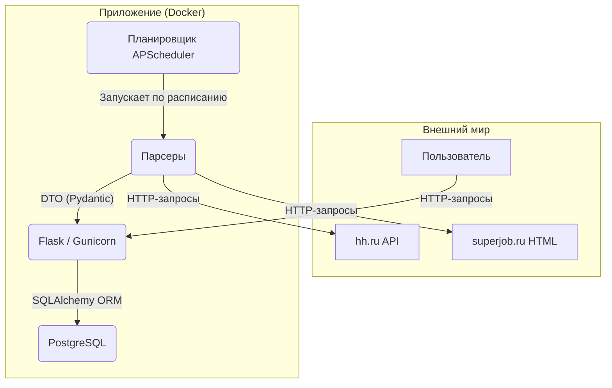

#  Job Vacancy Explorer (Агрегатор Вакансий)

<p align="left">
  <!-- Статус и Качество -->
  <a href="https://github.com/Relayn/job-vacancy-explorer/actions/workflows/ci.yml">
    
  </a>
  <a href="https://codecov.io/gh/Relayn/job-vacancy-explorer">
    
  </a>
  <a href="#">
    
  </a>
  <a href="#">
    
  </a>
  <!-- Технологии -->
  <br/>
  <a href="https://www.python.org/">
    
  </a>
  <a href="https://flask.palletsprojects.com/">
    
  </a>
  <a href="https://www.postgresql.org/">
    
  </a>
  <a href="https://www.docker.com/">
    
  </a>
  <!-- Лицензия -->
  <a href="https://opensource.org/licenses/MIT">
    
  </a>
</p>

**Job Vacancy Explorer** — это полностью автоматизированный агрегатор вакансий, который собирает, анализирует и представляет данные с ведущих российских платформ по поиску работы. Проект разработан с акцентом на надежность, качество кода и безопасность, используя современные практики DevOps и CI/CD.

---


## 🌟 Ключевые возможности

*   **Автоматическая агрегация:** Фоновый планировщик (`APScheduler`) регулярно собирает свежие вакансии с `hh.ru` и `superjob.ru`.
*   **Продвинутый поиск:** Мощный полнотекстовый поиск PostgreSQL по названию и описанию.
*   **Гибкая фильтрация:** Фильтрация результатов по местоположению, компании, источнику и диапазону заработной платы.
*   **Визуальная аналитика:** Интерактивные графики для анализа топ-компаний и средних зарплат по городам.
*   **Нормализация данных:** Вся информация о зарплате, независимо от валюты и формата ("от", "до", вилка), автоматически конвертируется в рубли.
*   **Готовность к Production:** Оптимизированный и безопасный Docker-образ, эндпоинт для мониторинга состояния (`/health`).

## 🛠️ Технологический стек и архитектура

Проект построен на надежном и масштабируемом стеке с четким разделением ответственности между компонентами.

| Категория          | Технологии                                                              |
| ------------------ | ----------------------------------------------------------------------- |
| **Бэкенд**         | `Python 3.11`, `Flask`, `Gunicorn`, `SQLAlchemy (ORM)`                  |
| **База данных**    | `PostgreSQL 16`, `Alembic` (для миграций схемы)                         |
| **Фронтенд**       | `HTML`, `Bootstrap 5`, `Chart.js` (для графиков)                        |
| **Парсинг**        | `Requests`, `BeautifulSoup4`, `Pydantic` (для валидации и DTO)          |
| **DevOps**         | `Docker`, `Docker Compose`, `GitHub Actions` (CI/CD)                    |
| **Качество кода**  | `Pytest`, `pytest-cov` (90% покрытие), `Ruff`, `Mypy`, `Bandit`, `pre-commit` |

### Диаграмма архитектуры



## 🚀 Как запустить проект

Проект полностью контейнеризирован с помощью Docker, что обеспечивает быстрый и предсказуемый запуск на любой системе.

### 1. Предварительные требования

*   **Docker** и **Docker Compose** (обычно поставляются вместе с Docker Desktop).
*   **Git** для клонирования репозитория.

### 2. Установка

1.  **Клонируйте репозиторий:**
    ```bash
    git clone https://github.com/Relayn/job-vacancy-explorer.git
    cd job-vacancy-explorer
    ```

2.  **Создайте файл окружения:**
    Скопируйте файл `.env.example` в `.env`. Значения по умолчанию идеально подходят для локального запуска.
    ```powershell
    # Для Windows (в PowerShell или CMD)
    copy .env.example .env
    ```
    ```bash
    # Для macOS/Linux
    cp .env.example .env
    ```

3.  **Запустите Docker Compose:**
    Эта команда в фоновом режиме (`-d`) соберет Docker-образ, создаст тома для базы данных и запустит контейнеры приложения и PostgreSQL.
    ```bash
    docker-compose up --build -d
    ```
    **Важно:** При первом запуске `Dockerfile` автоматически выполнит миграции базы данных (`alembic upgrade head`). Вам не нужно делать это вручную.

4.  **Проверьте работоспособность:**
    Подождите около 30 секунд, пока сервисы полностью запустятся.
    *   Откройте в браузере **[http://localhost:9065](http://localhost:9065)**. Вы должны увидеть главную страницу приложения.
    *   Проверьте эндпоинт состояния: **[http://localhost:9065/health](http://localhost:9065/health)**. Вы должны увидеть `{"status": "ok"}`.

✅ **Готово!** Приложение полностью функционирует. Фоновый парсер уже запущен и начнет собирать вакансии в соответствии с настройками в `.env`.

## ✅ Качество и надежность

Этот проект был разработан с использованием практик, обеспечивающих высокое качество кода, безопасность и стабильность.

*   **CI/CD Пайплайн:** Каждый коммит автоматически проходит через 4-этапный пайплайн в **GitHub Actions**, который включает:
    1.  **Линтинг и статический анализ** (`Ruff`, `Mypy`).
    2.  **Unit-тесты** (с проверкой покрытия >90%).
    3.  **Сканирование безопасности** (`Bandit`, `pip-audit`).
    4.  **Интеграционные тесты** с реальной базой данных PostgreSQL.

*   **Высокое покрытие тестами:** Проект имеет **90% покрытие кода** unit-тестами, что гарантирует надежность бизнес-логики.

*   **Автоматическое обновление зависимостей:** `Dependabot` настроен для автоматического создания Pull Request'ов при появлении обновлений безопасности для зависимостей.

*   **Безопасность по умолчанию:** Используется `Pydantic Settings` для управления конфигурацией через переменные окружения, что исключает попадание секретов в код. ORM защищает от SQL-инъекций. Production Docker-образ оптимизирован (multi-stage build) и запускается от имени пользователя с ограниченными правами для минимизации рисков.

## 🗺️ Дальнейшее развитие (Roadmap)

- [ ] **Интеграция с Codecov** для динамического отслеживания покрытия тестами.
- [ ] **Внедрение Celery и Redis** для более надежного управления фоновыми задачами.
- [ ] **Расширение аналитики** новыми метриками и графиками.

## ⚖️ Лицензия

Проект распространяется под лицензией MIT. Подробности смотрите в файле [LICENSE](LICENSE).
